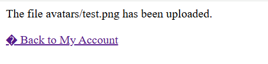

## 1. Thông tin bài lab
- Tên lab: **Web shell upload via path traversal**
- Loại lỗ hổng: Path Traversal, File upload -> RCE (Remote Code Execution)
- Link bài lab: [Web shell upload via path traversal](https://portswigger.net/web-security/file-upload/lab-file-upload-web-shell-upload-via-content-type-restriction-bypass](https://portswigger.net/web-security/file-upload/lab-file-upload-web-shell-upload-via-path-traversal)
- **Mục tiêu**: Upload webshell vào thư mục thực thi mã PHP, chiếm quyền điều khiển server và đọc nội dung tệp tin bí mật _**/home/carlos/secret**_
## 2. Phân tích ban đầu
**Chức năng ứng dụng:** 
- Sau khi đăng nhập tài khoản người dùng, người dùng có thể update email, upload ảnh avatar của người dùng.

- Sau khi upload, ứng dụng thông báo đã upload thành công và đường dẫn lưu file ảnh upload.

**Đặt giả thuyết**
-	Kiểm tra xem liệu ta có thể upload và thực thi một file php bằng cách tạo một file tên _test.php_ với nội dung `<?php phpinfo(); ?>` và upload lên server.
- Upload thành công nhưng file _test.php_ không được thực thi mà chỉ hiển thị dưới dạng text

img

- Có vẻ như trang web được cấu hình không thực thi các file .php trong thư mục _/files/avatars/_
- Nếu như ta có thể upload file .php tới một thư mục khác thì liệu trang web có thực thi mã PHP không.

**Kiểm tra giả thuyết**
- Ta có đường dẫn lưu file upload là **_/var/www/html/files/avatars/_**.
- Thử lưu file upload tới đường dẫn **_/var/www/html/files/**
- Vậy tên file được sửa thành **_../test.php_** và đường dẫn chuẩn mà ta cần là: **_/var/www/html/files/avatars/../test.php_**

img

- Khi thực hiện upload, file _test.php_ không lưu theo đường dẫn ta muốn. 

img

- Thử upload lại với các kí tự _'/'_ đã được mã hóa URL

img
