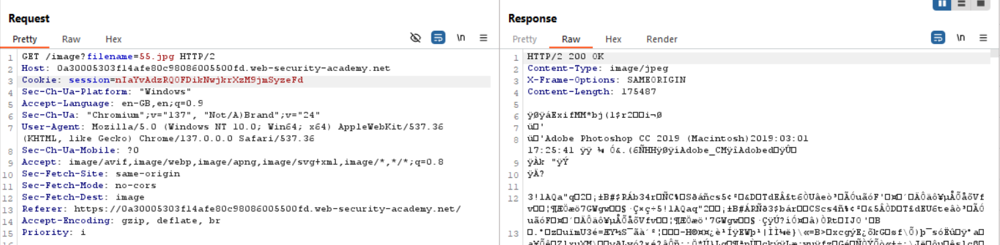

## 1. Thông tin bài lab
- Tên lab: **File path traversal, simple case**
- Loại lỗ hổng: File upload -> RCE (Remote Code Execution)
- Link bài lab: [Web shell upload via obfuscated file extension](https://portswigger.net/web-security/file-upload/lab-file-upload-web-shell-upload-via-obfuscated-file-extension)
- **Mục tiêu**: Upload webshell vào thư mục thực thi mã PHP, chiếm quyền điều khiển server và đọc nội dung tệp tin bí mật _**/home/carlos/secret**_
## 2. Phân tích ban đầu
**Chức năng ứng dụng:** 
- Sau khi đăng nhập tài khoản người dùng, người dùng có thể update email, upload ảnh avatar của người dùng.

- Sau khi upload, ứng dụng thông báo đã upload thành công và đường dẫn lưu file ảnh upload.

