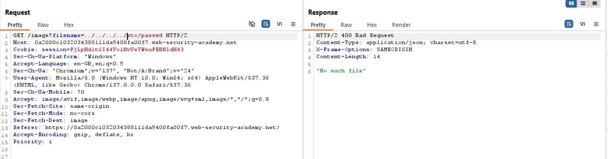
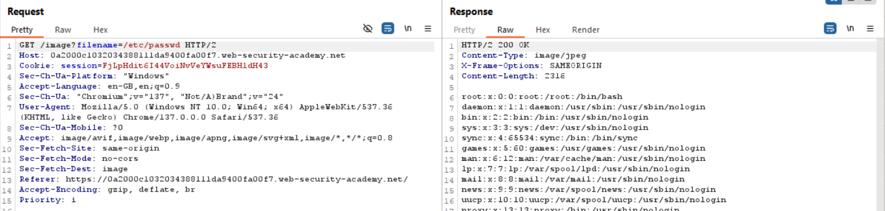

## 1. Thông tin bài lab
- Tên lab: **File path traversal, traversal sequences blocked with absolute path bypass**
- Loại lỗ hổng: Path traversal 
- Link bài lab: [File path traversal, traversal sequences blocked with absolute path bypass](https://portswigger.net/web-security/file-path-traversal/lab-absolute-path-bypass)
- **Mục tiêu**: Trích xuất nội dung tệp tin _**/etc/passwd**_
## 2. Phân tích ban đầu
**Chức năng ứng dụng:** 
- Giao diện ứng dụng trưng bày các sản phẩm:

- Sau khi lựa chọn nút _View details_ hiển thị hình ảnh và miêu tả tương ứng

**Đặt giả thuyết**
- Thử nghiệm với đường dẫn tương đối **filename=../../../etc/passwd** thì thấy không truy cập được file, có vẻ như server đã filter để loại bỏ những ký tự đặc biệt.

- Vậy nếu ta truyền một đường dẫn tuyệt đối thì liệu có thể đọc được nội dung file không?
**Kiểm tra giả thuyết**
- Truyền đường dẫn tuyệt đối vào parameter **filename=/etc/passwd**
- Kết quả, ta đã đọc được nội dung của tệp tin -> Hoàn thành bài lab

