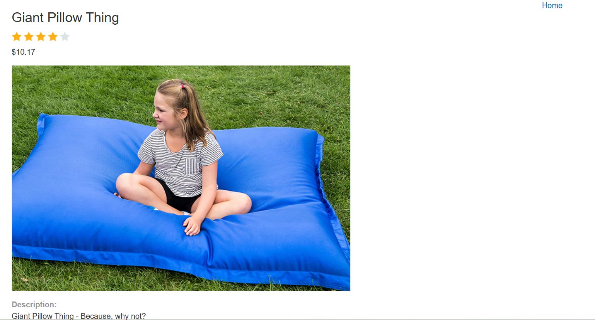
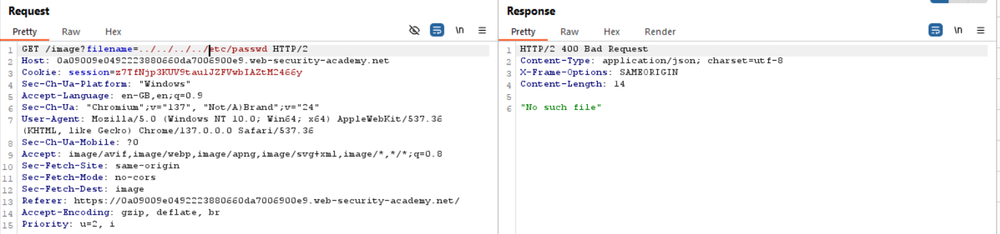

## 1. Thông tin bài lab
- Tên lab: **File path traversal, traversal sequences stripped non-recursively**
- Loại lỗ hổng: Path traversal 
- Link bài lab: [File path traversal, traversal sequences stripped non-recursively](https://portswigger.net/web-security/file-path-traversal/lab-sequences-stripped-non-recursively)
- **Mục tiêu**: Trích xuất nội dung tệp tin _**/etc/passwd**_
## 2. Phân tích ban đầu
**Chức năng ứng dụng:** 
- Giao diện ứng dụng trưng bày các sản phẩm:

- Sau khi lựa chọn nút _View details_ hiển thị hình ảnh và miêu tả tương ứng

- Khi đó, thông qua Burpsuite, ta bắt được một số gói tin lấy thông tin về sản phẩm, hình ảnh mô tả sản phẩm

- Quan sát thấy có gói tin có thể load được file ảnh và xem nội dung file tại đường dẫn **/image** và tham số đưa vào là **filename**.

## 3. Tiến hành khai thác
- Thử nghiệm với cả đường dẫn tương đối và đường dẫn tuyệt đối đều không thể xem nội dung file -> server đã áp dụng một filter vào parameter

**Đặt giả thiết**
- Theo hướng dẫn của bài lab, server chỉ thực hiện loại bỏ lần lượt các chuỗi ký tự **../** trước khi thực thi.
- Vậy liệu rằng có thể làm cho chuỗi kí tự **../** xuất hiện sau khi loại bỏ không?

**Kiểm tra giả thuyết**
- Nếu ta nhập chuỗi **....//**, vậy nếu server chỉ loại bỏ chuỗi kí tự **../** th ta còn chuỗi **../**
- Sau khi thử nghiệm, ta đã đọc được nội dung tệp -> Hoàn thành bài lab

