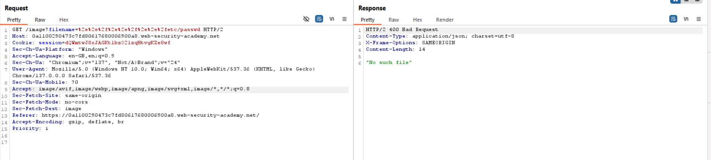
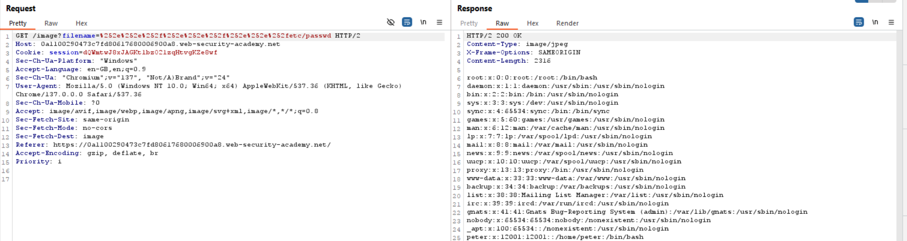

## 1. Thông tin bài lab
- Tên lab: **File path traversal, traversal sequences stripped with superfluous URL-decode**
- Loại lỗ hổng: Path traversal 
- Link bài lab: [File path traversal, traversal sequences stripped with superfluous URL-decode](https://portswigger.net/web-security/file-path-traversal/lab-superfluous-url-decode)
- **Mục tiêu**: Trích xuất nội dung tệp tin _**/etc/passwd**_
## 2. Phân tích ban đầu
**Chức năng ứng dụng:** 
- Giao diện ứng dụng trưng bày các sản phẩm:

- Sau khi lựa chọn nút _View details_ hiển thị hình ảnh và miêu tả tương ứng

- Khi đó, thông qua Burpsuite, ta bắt được một số gói tin lấy thông tin về sản phẩm, hình ảnh mô tả sản phẩm

- Quan sát thấy có gói tin có thể load được file ảnh và xem nội dung file tại đường dẫn **/image** và tham số đưa vào là **filename**.

## 3. Tiến hành khai thác
- Theo giả thiết bài lab, server chặn các chuỗi duyệt đường dẫn và thực hiện URL decode các dữ liệu đầu vào trước khi sử dụng.
- Ta thử mã hóa URL các chuỗi duyệt đường dẫn trên các tham số đầu vào thì thấy vẫn không xem được nội dung tệp tin.

- Tiếp tục thử mã hóa lần 2 trên tham số được mã hóa ở trên thì có thể xem được nội dung tệp tin.

