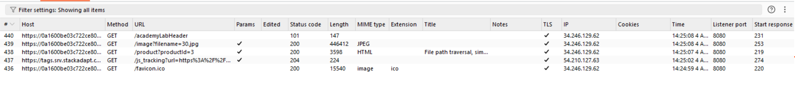

## 1. Thông tin bài lab
- Tên lab: **File path traversal, validation of file extension with null byte bypass**
- Loại lỗ hổng: Path traversal 
- Link bài lab: [File path traversal, validation of file extension with null byte bypass](https://portswigger.net/web-security/file-path-traversal/lab-validate-file-extension-null-byte-bypass)
- **Mục tiêu**: Trích xuất nội dung tệp tin _**/etc/passwd**_
## 2. Phân tích ban đầu
**Chức năng ứng dụng:** 
- Giao diện ứng dụng trưng bày các sản phẩm:

- Sau khi lựa chọn nút _View details_ hiển thị hình ảnh và miêu tả tương ứng

- Khi đó, thông qua Burpsuite, ta bắt được một số gói tin lấy thông tin về sản phẩm, hình ảnh mô tả sản phẩm

- Quan sát thấy có gói tin có thể load được file ảnh và xem nội dung file tại đường dẫn **/image** và tham số đưa vào là **filename**.

- Theo thử nghiệm thì ta có thể sử dụng chuỗi duyệt đường dẫn để xem nội dung file

- Theo giả thuyết bài lab, ứng dụng xác thực tệp được truy cập dựa trên extension của tệp, cụ thể ở đây là chỉ cho phép truy cập tệp hình ảnh còn các tệp khác thì không.

## 3. Tiến hành khai thác
- Thử kết hợp ký tự NULL đã được URL encode vào cuối tên file kèm extension **.png**
- Kết quả ta có thể xem nội dung tệp tin -> Hoàn thành bài lab.

