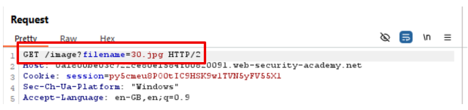

## 1. Thông tin bài lab
- Tên lab: **File path traversal, simple case**
- Loại lỗ hổng: Path traversal 
- Link bài lab: [File path traversal, simple case](https://portswigger.net/web-security/file-path-traversal/lab-simple)
- **Mục tiêu**: Trích xuất nội dung tệp tin _**/etc/passwd**_
## 2. Phân tích ban đầu
**Chức năng ứng dụng:** 
- Giao diện ứng dụng trưng bày các sản phẩm:

- Sau khi lựa chọn nút _View details_ hiển thị hình ảnh và miêu tả tương ứng

- Khi đó, thông qua Burpsuite, ta bắt được một số gói tin lấy thông tin về sản phẩm, hình ảnh mô tả sản phẩm

- Quan sát thấy có gói tin có thể load được file ảnh và xem nội dung file tại đường dẫn **/image** và tham số đưa vào là **filename**.

**Đặt giả thuyết**
- Qua đó, ta đưa ra giả thuyết:
  - **GT1:** Liệu có thể đọc được nội dung file với filename khác hay không?
  - **GT2:** Liệu có thể đọc nội dung file ở một đường dẫn khác không?

**Kiểm tra giả thuyết**
- Có thể xem nội dung file khác nhưng filename phải tồn tại trên server.

- Do không biết, đường dẫn hiện tại đang ở đâu ta thêm nhiều lần các ký tự **../** để thử nghiệm, và thấy sau 3 lần ta đã có thể xem nội dung file **/etc/passwd**

