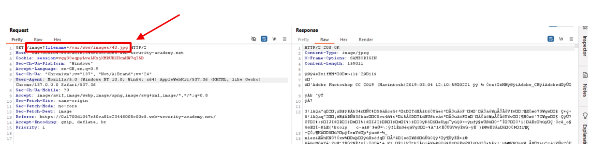
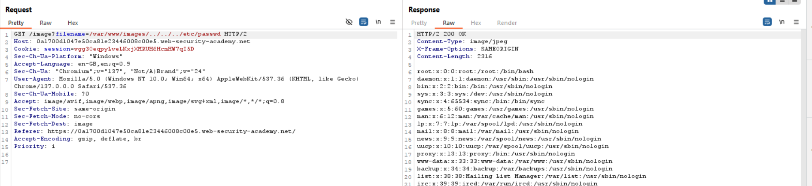

## 1. Thông tin bài lab
- Tên lab: **File path traversal, validation of start of path**
- Loại lỗ hổng: Path traversal 
- Link bài lab: [File path traversal, validation of start of path](https://portswigger.net/web-security/file-path-traversal/lab-validate-start-of-path)
- **Mục tiêu**: Trích xuất nội dung tệp tin _**/etc/passwd**_
## 2. Phân tích ban đầu
**Chức năng ứng dụng:** 
- Giao diện ứng dụng trưng bày các sản phẩm:

- Sau khi lựa chọn nút _View details_ hiển thị hình ảnh và miêu tả tương ứng

- Khi đó, thông qua Burpsuite, ta bắt được một số gói tin lấy thông tin về sản phẩm, hình ảnh mô tả sản phẩm

- Quan sát thấy có gói tin có thể load được file ảnh và xem nội dung file tại đường dẫn **/image** và tham số đưa vào là **filename**.

- Khi bắt gói tin truy cập đến file ảnh, ta có thể thấy tham số truyền vào là một đường dẫn đầy đủ.

## 3. Tiến hành khai thác
- Theo như phân tích, khi muốn truy cập đến file cần truyền đường dẫn đầy đủ vào parameter, ở đây ta thử `filename=/var/www/images/../../../etc/passwd`
- Kết quả ta đã xem được nội dung tệp tin -> Hoàn thành bài lab

